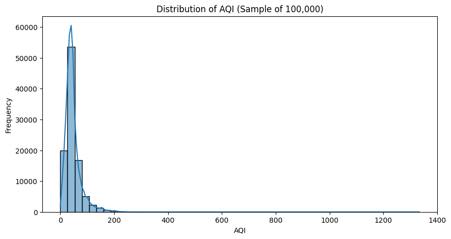
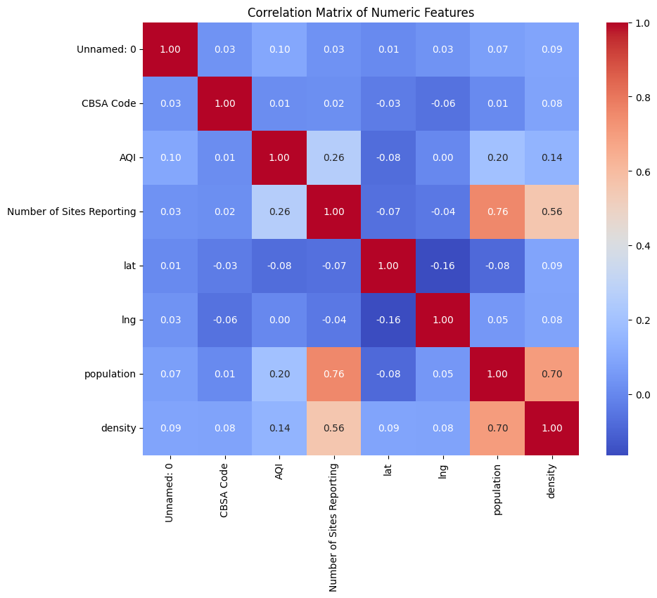
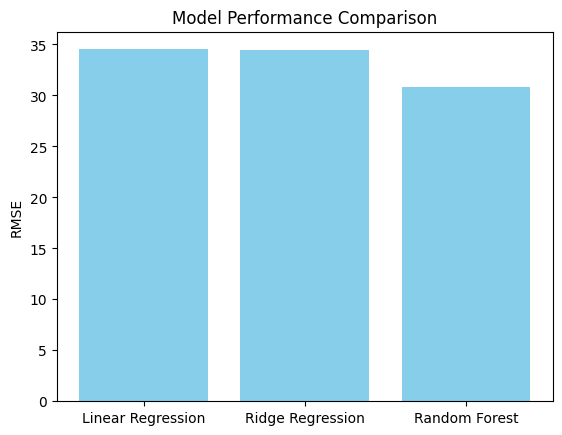

# 🌿 Air Quality Prediction (U.S. Region)

**Type:** Regression Project  
**Date:** April 2025 

This project predicts daily Air Quality Index (AQI) across U.S. regions using Linear Regression, Ridge Regression, and Random Forest. It explores the impact of geographic, demographic, and pollution data on air quality trends.

🧪 Built in a Jupyter Notebook environment using Python libraries (pandas, numPy, scikit-learn, matplotlib).  

---

## 📁 Project Files

- [`Air_Quality_Prediction.ipynb`]([aqi_prediction.ipynb](https://github.com/alyssaday01/us-aqi-regression/blob/main/aqi_prediction.ipynb): Full notebook with data processing, modeling, and results.
- [`/images`](link-to-images-folder): Visualizations used in the notebook and portfolio site.

---

## 📁 Dataset 
- **Source:** [U.S. Air Quality (1980–Present) – Kaggle](https://www.kaggle.com/datasets/calebreigada/us-air-quality-1980present)
- **Time Range:** 1980 - Present
- **Details:** Includes daily AQI, pollutant type, location data (lat/lng), and demographics.

---

## 🧪 Models Used

- Linear Regression
- Ridge Regression
- Random Forest Regressor

---

## 🔑 Highlights

- Created time-based and interaction features (e.g., population × density).
- Used train/test splits and evaluated models using RMSE.
- Found Random Forest outperformed other models in capturing AQI variation.

---

## 🔗 Project Repository

[View this project on GitHub]([https://github.com/yourusername/your-repo-name](https://github.com/alyssaday01/us-aqi-regression))

---

## 📷 Visuals

---

## 🧾 Credits

- Data by Caleb Reigada via Kaggle  
- Project by Alyssa Day (2025)
